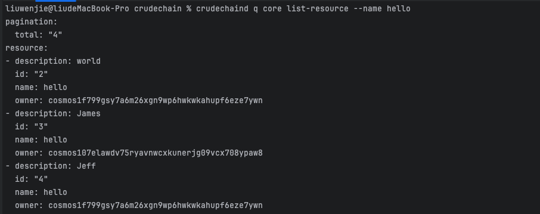

# Problem 5: A Crude Chain

## How to Run

1. Run the chain
    ```shell
    ignite chain serve
   ```

2. Create Resources
    ```shell
    crudechaind tx core create-resource hello world --from alice --chain-id crudechain
    crudechaind tx core create-resource hello James --from bob --chain-id crudechain
    crudechaind tx core create-resource hello Jeff --from alice --chain-id crudechain
    crudechaind tx core create-resource hello Jack --from bob --chain-id crudechain
   ```

3. Search Resource By Id
    ```shell
   crudechaind q core show-resource 1
   ```
   
4. Show All Resources
    ```shell
   crudechaind q core list-resource
   ```
   
5. Delete One Resource
    ```shell
   crudechaind tx core delete-resource 0 --from alice  --chain-id crudechain
   crudechaind q core list-resource //check the resource again
   ```
6. Update One Resource
    ```shell
   crudechaind tx core  update-resource 1  "I Love" "Golang" --from alice
   ```
   
7. Filter: Filter By Name
    ```shell
   crudechaind q core list-resource --name hello
   ```
   
# Consensus-Breaking Change

## 1. What Does Breaking Consensus mean?
**Breaking consensus** refers to introducing changes to the blockchain protocol or its initial state that result in nodes disagreeing on the validity of blocks or transactions.   
In a blockchain network:
* All nodes rely on the same rules to validate transactions and blocks.
* If some nodes follow different rules (e.g., due to code or configuration changes), they may reject blocks that other nodes accept.
* This can lead to a chain split (fork) or cause the blockchain to halt.

## 2. Why My Change Would Break Consensus
- **Modification to genesis.json**
    - In this branch, I modified the `genesis.json` file on my local machine.
      Directly modifying the `genesis.json` file on a single node breaks consensus because it creates an inconsistent initial state.
      All nodes must share the same genesis configuration to validate blocks and transactions uniformly. A mismatch causes the modified node to reject or produce blocks that other nodes consider invalid, leading to a chain split or halting network progress.

- **Modification to resource structure**
    - I added a new field to the resource.
      This disrupted the original order of fields, potentially causing serialization or compatibility issues, which could further lead to consensus-breaking behavior.
